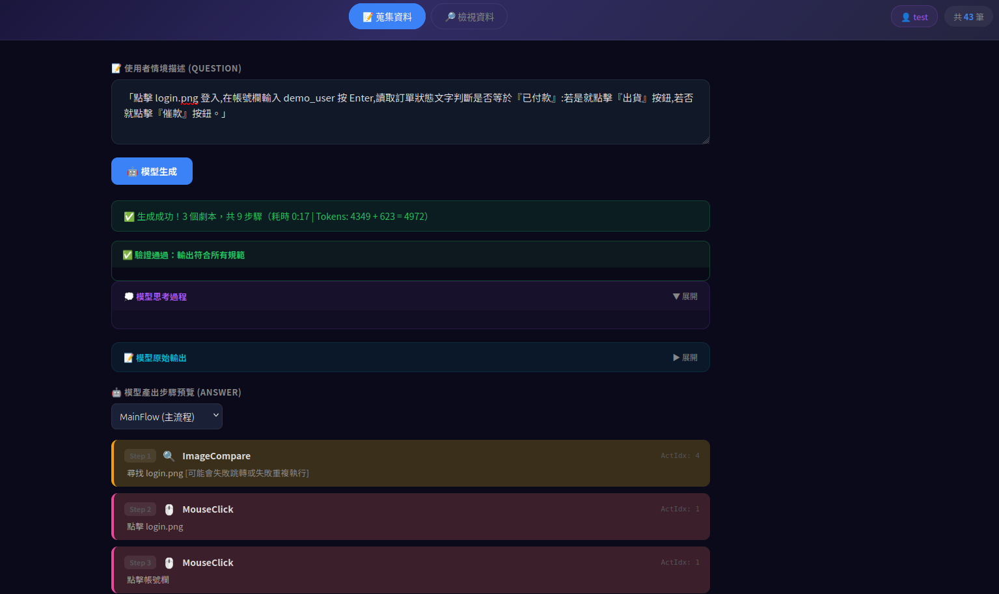
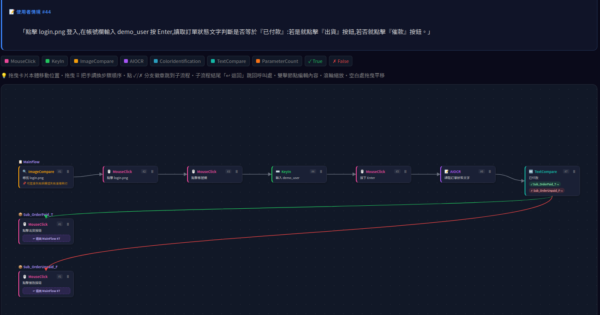
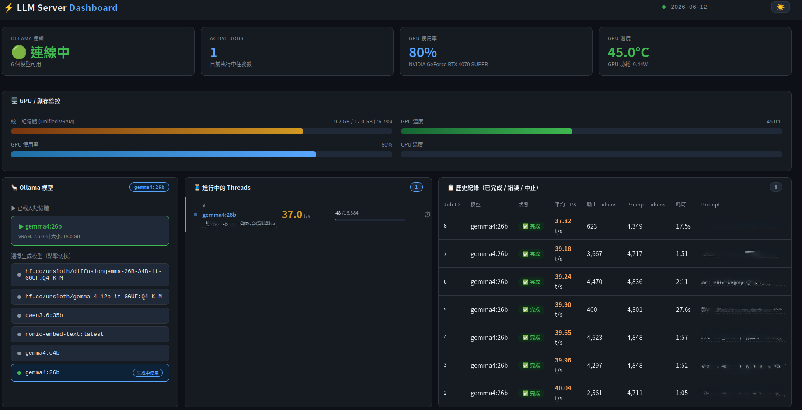
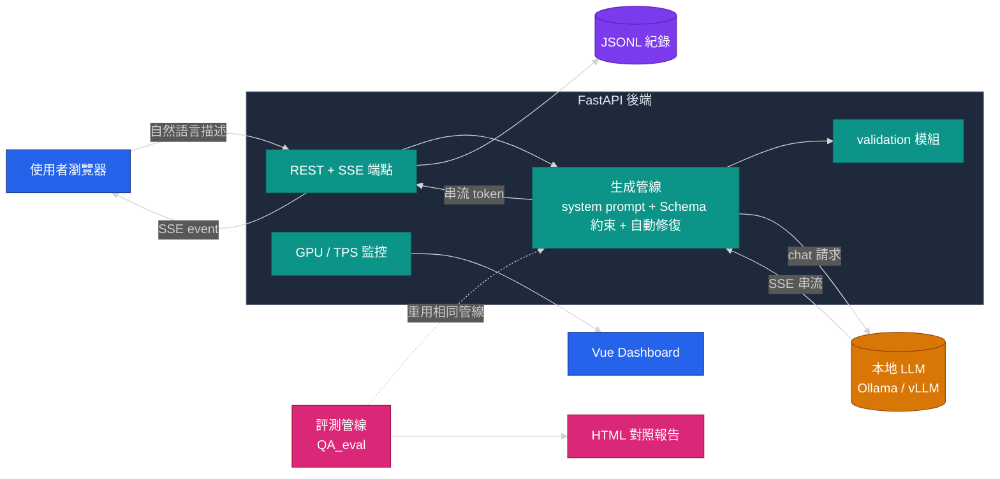

# NL2RPA — 自然語言轉 RPA 自動化劇本的 LLM 應用平台

> Turn natural-language process descriptions into structured, branch-aware RPA workflows with a local LLM — plus a full evaluation pipeline to measure generation quality.

一套以**本地端 LLM**為核心的應用平台:使用者用自然語言描述一段操作流程,系統自動產出符合規範、可含條件分支的 **RPA 自動化劇本 JSON**,並提供串流生成、流程圖視覺化、編輯歷史,以及一套**結構化自動評測管線**來量化生成品質。

> ℹ️ **關於本 repo**:這是一份**工程案例研究(Case Study)**。實際的 production 系統為公司內部工具,原始碼不公開;此處的文件、架構與 `examples/` 範例皆為**重新撰寫的領域中性示意**,用於呈現系統設計與技術決策,所有情境均使用通用範例(電商、表單、後台操作),不含任何特定領域或機密內容。

---

## 目錄

- [解決的問題](#解決的問題)
- [Demo](#demo)
- [系統架構](#系統架構)
- [技術亮點](#技術亮點)
- [評測方法論](#評測方法論)
- [Prompt 設計](#prompt-設計)
- [技術棧](#技術棧)
- [快速體驗範例](#快速體驗範例)

---

## 解決的問題

RPA(機器人流程自動化)劇本通常需要工程師**手動逐步拼裝**:找圖、點擊、輸入、判斷、分支……一個稍複雜的流程動輒數十個步驟,撰寫耗時且容易出錯。

本平台讓使用者**只需用一句自然語言描述流程**,例如:

> 「點擊 login.png 登入,在帳號欄輸入 demo_user 按 Enter,讀取訂單狀態文字判斷是否等於『已付款』:若是就點擊『出貨』按鈕,若否就點擊『催款』按鈕。」

系統即自動產出結構化、可直接被 RPA 引擎執行的劇本 JSON,包含**複合動作拆解**(「點擊欄位並輸入」自動拆成兩步)、**先取得後判斷**的順序約束,以及**條件分支**(TrueCall / FalseCall 跳轉子劇本)。

---

## Demo

> 截圖使用去識別化的示意資料(dashboard 內容作模糊化處理)。

| 生成主頁面 | 流程圖視覺化 | 硬體監控 + 模型狀態 |
|---|---|---|
|  |  |  |


---

## 系統架構



**設計原則:生成與評測共用同一條管線**——評測腳本呼叫與線上服務**完全相同**的 system prompt、Schema 約束與修復邏輯,確保「離線評測分數」能真實反映「線上生成品質」。

---

## 技術亮點

| 主題 | 說明 |
|---|---|
| **SSE 串流生成 + 精準中止** | 透過 Server-Sent Events 即時推送生成 token;每次生成配發唯一 `gen_id`,可在多人並發下**精準中止指定的單一請求**而不影響他人。 |
| **JSON Schema 約束 + 自動修復** | 以結構化 schema 約束 LLM 輸出格式;對常見瑕疵(code fence、結尾逗號、缺欄位)做 `repair_output` 自動修復,大幅降低解析失敗率。 |
| **多輪對話記憶** | Session 級別的對話記憶,使用者可在同一 session 內以追加描述修正上一輪結果。 |
| **結構化自動評測** | 一套可量化的評測管線:步驟序列 F1 + 劇本結構 Jaccard + 規則驗證,並以穩定的 `qid` 支援資料集增刪後的題目回溯。詳見 [評測方法論](docs/evaluation.md)。 |
| **規則化 Prompt 工程** | 將「複合動作拆解、先取得後判斷、條件分支路由、備註規則」設計成明確的生成規則,並以 few-shot 範例固化行為。詳見 [Prompt 設計](docs/prompt-design.md)。 |
| **流程圖視覺化** | 自動將劇本渲染成 Mermaid 流程圖,主流程與子劇本以實線/虛線箭頭區分,支援縮放、平移與 SVG 匯出。 |
| **即時效能監控** | Vue Dashboard 即時顯示 GPU 使用率、各生成任務的 TPS(以 HuggingFace tokenizer 精算 token 數),可觀測並發負載。 |
| **雙推論後端** | 同一套服務支援 **Ollama** 與 **vLLM** 兩種本地推論後端,可依硬體切換。 |

詳細架構說明見 [docs/architecture.md](docs/architecture.md)。

---

## 評測方法論

如何客觀衡量「LLM 把流程描述轉成劇本」這件事做得好不好?本專案設計了一套結構化評分:

```
綜合分 = 70% 步驟相似度 F1  +  20% 劇本結構 Jaccard  +  10% 規則驗證分
```

- **步驟相似度 F1**:子劇本正規化改名後,各劇本步驟以動作序列對齊,配對步驟依欄位加權計分,漏掉與多出的步驟計 0,最後以 precision/recall 調和平均彙總。
- **劇本結構 Jaccard**:比較主流程與子劇本集合的結構相似度。
- **規則驗證分**:生成結果是否通過格式與業務規則驗證。

完整說明與計分邏輯見 [docs/evaluation.md](docs/evaluation.md);可執行的精簡示意見 [examples/evaluate_demo.py](examples/evaluate_demo.py)。

---

## Prompt 設計

生成品質的關鍵不在模型大小,而在**把領域規則寫成模型能穩定遵守的指令**。本專案的 system prompt 把流程轉換拆成數條明確規則:

1. **角色與輸出限制**:只輸出純 JSON,禁止前言/結語/code fence。
2. **複合動作拆解**:「點擊 .png 目標」→ 先 `ImageCompare` 後 `MouseClick`。
3. **先取得後判斷**:要比較文字必先 `AIOCR`,要判斷數值必先取得來源。
4. **業務路由**:只有「判斷型」步驟可掛 `TrueCall` / `FalseCall` 分支到子劇本,且需使用者明確寫出成立/不成立要做的事。
5. **備註規則**:依步驟類型決定備註內容,避免模型自由發揮。

詳見 [docs/prompt-design.md](docs/prompt-design.md)。

---

## 技術棧

| 層 | 技術 |
|---|---|
| 後端 | Python 3.9+、FastAPI、SSE(Server-Sent Events) |
| 推論 | Ollama / vLLM(本地 LLM) |
| 前端 | Vue 3 + Vite(監控 Dashboard)、原生 JS + Mermaid.js(主介面/流程圖) |
| 資料 | JSONL(輕量、可文字 diff) |
| 評測 | 自製評測管線、HTML 對照報告 |

---

## 快速體驗範例

`examples/` 內含**獨立、可直接執行**的領域中性示意:

```bash
# 生成管線示意(預設 mock,不需安裝任何套件;有 Ollama 可切換實跑)
python examples/generate_demo.py

# 評測計分示意(步驟序列 F1)
python examples/evaluate_demo.py
```

---

## 這個專案負責的部分

- 後端 API 與 SSE 串流生成管線設計與實作
- system prompt 規則設計與 few-shot 迭代
- 結構化自動評測方法論設計與實作
- 流程圖視覺化與監控 Dashboard
- Ollama / vLLM 雙後端整合

---

## License

[MIT](LICENSE)
