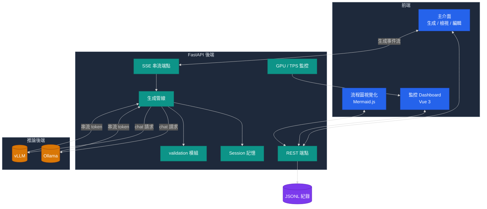
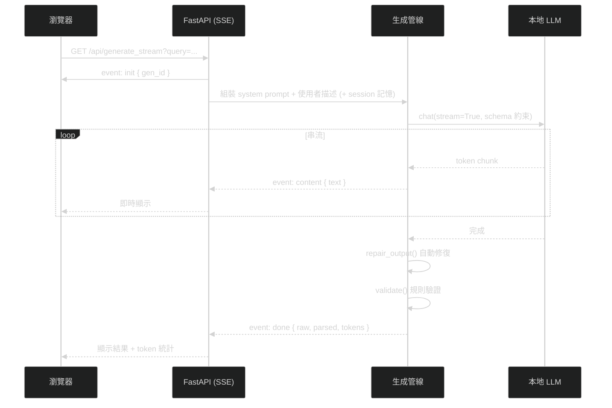

# 系統架構

> 本文件描述 NL2RPA 平台的整體架構與關鍵設計決策。內容為領域中性的工程說明,不含任何特定領域或機密資訊。

---

## 總覽

平台由四個部分組成:

1. **FastAPI 後端**——提供 REST 與 SSE 端點,承載生成管線。
2. **本地 LLM 推論**——Ollama 或 vLLM,負責實際的文字生成。
3. **前端**——主介面(生成 + 檢視 + 流程圖)與監控 Dashboard。
4. **評測管線**——離線腳本,重用線上的生成管線來量化品質。



---

## 生成管線

一次生成請求的生命週期:



### 關鍵設計

**1. 精準中止(per-request abort)**
每次生成配發唯一 `gen_id` 並登記在伺服器端。前端可呼叫 `/api/abort { gen_id }` 只中止該筆生成;不帶 `gen_id` 則中止全部(向下相容)。在多人並發時,這避免「A 使用者按停止卻中斷了 B 的生成」。

**2. JSON Schema 約束 + 自動修復**
- 生成時以結構化 schema 約束輸出,降低自由發揮。
- 即便如此,LLM 偶爾仍會輸出 code fence、結尾逗號、缺欄位等瑕疵。`repair_output` 在解析前做一層容錯修復,把「幾乎正確」的輸出救回來,顯著降低解析失敗率。

**3. 生成 / 評測共用管線**
評測腳本不另寫一套生成邏輯,而是 import 與線上**完全相同**的 prompt 組裝、schema 約束與修復函式。這保證評測分數能代表線上真實表現,避免「評測用的管線跟線上不一樣」造成的失真。

---

## 資料格式

紀錄以 JSONL(每行一個 JSON)儲存,純文字、可直接 `git diff`、可手動備份。

每個劇本步驟為固定 7 欄位的物件:

| 欄位 | 說明 |
|---|---|
| `GUID` | 唯一碼(由前端填入) |
| `Name` | 工具名稱 |
| `ActIdx` | 工具動作編號 |
| `Desc` | 步驟描述(關鍵字) |
| `Remark` | 備註(如失敗跳轉) |
| `TrueCall` | 條件成立時跳轉的子劇本名稱 |
| `FalseCall` | 條件不成立時跳轉的子劇本名稱 |

頂層結構:

```json
{
  "MainFlow": [ /* 主流程步驟 */ ],
  "Sub_XxxYyy_T": [ /* 某判斷成立時進入的子劇本 */ ],
  "Sub_XxxYyy_F": [ /* 某判斷不成立時進入的子劇本 */ ]
}
```

---

## 動作工具集(示意)

平台抽象出一組通用的 UI 自動化動作。下表為**示意用**的通用工具集:

| Name | 用途 | 可分支 |
|---|---|---|
| `MouseClick` | 點擊按鈕 / 欄位 / 座標 | ✗ |
| `KeyIn` | 輸入文字 | ✗ |
| `ImageCompare` | 在畫面上尋找圖像目標,回傳座標 | ✗ |
| `AIOCR` | 辨識畫面文字,回傳字串 | ✗ |
| `ColorIdentification` | 顏色辨識 | ✓ |
| `TextCompare` | 字串比對(前一步須為 AIOCR) | ✓ |
| `ParameterCount` | 數值 / 尺寸判斷(前一步須先取得來源) | ✓ |

只有「判斷型」工具(顏色 / 文字 / 數值)能設定 `TrueCall` / `FalseCall` 分支。

---

## 監控

監控 Dashboard(Vue 3)即時呈現:

- **GPU 使用率**——支援 `nvidia-smi`(x86 NVIDIA)與 `jtop`(Jetson)兩種後端。
- **各生成任務 TPS**——以 HuggingFace tokenizer 精算 token 數,而非字元估算,得到準確的每秒 token 數。
- **進行中任務清單**——狀態、耗時、prompt 預覽。

這讓並發負載與推論效能可被即時觀測,方便調參與容量規劃。
