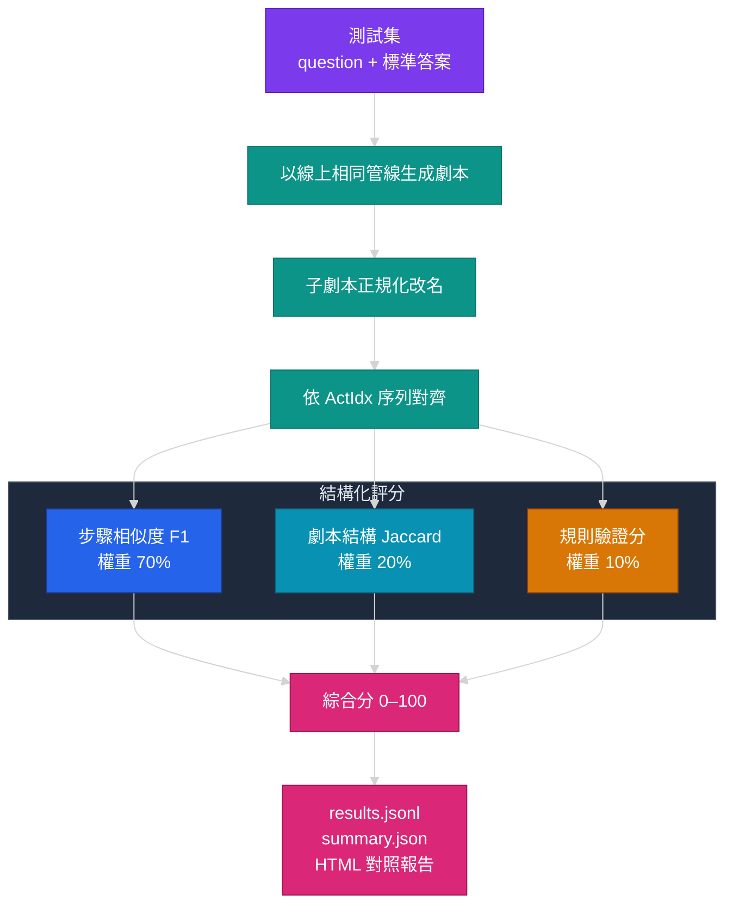

# 評測方法論

> 如何客觀量化「LLM 把自然語言流程轉成 RPA 劇本」做得好不好。本文件為領域中性的方法論說明。

---

## 為什麼需要結構化評測

「生成劇本」不像分類任務有單一正解,也不適合只看字串完全相等——同一個流程,子劇本命名不同、步驟描述用詞不同,都可能是對的。但我們仍需要一個**可重現、可比較**的分數,才能回答:

- 換了模型 / 調了 prompt,品質是變好還是變差?
- 哪一類題目最常出錯?
- 這次的退步出在哪幾題?

因此設計了一套結構化評分,把劇本拆成可比對的單元逐項計分。

---

## 綜合評分

每題 0–100 分:

```
綜合分 = 70% 步驟相似度 F1
       + 20% 劇本結構 Jaccard
       + 10% 規則驗證分
```

JSON 解析失敗或生成錯誤 → 該題 0 分。

### 評分流程



---

## 1. 步驟相似度 F1(權重 70%)

最核心的指標,衡量「生成的步驟」與「標準答案的步驟」有多接近。

### 步驟 1:子劇本正規化改名

子劇本的**名字本身不重要**,重要的是它的內容與被誰呼叫。因此先把子劇本依其在主流程中被呼叫的位置正規化改名(例如統一成 `Sub_1_T`、`Sub_2_F`),避免因命名不同而誤判為錯。

### 步驟 2:序列對齊

每個劇本內,將生成與標準答案的步驟,依**動作編號(ActIdx)序列**做對齊(類似 diff 的最長共同子序列),找出哪些步驟互相配對。

### 步驟 3:欄位加權計分

每一對配對的步驟,依欄位加權算相似度(0–1):

| 欄位 | 權重 | 說明 |
|---|---|---|
| 工具(Name) | 0.5 | 用對工具是最重要的 |
| 分支(TrueCall/FalseCall) | 0.3 | 分支跳轉是否正確 |
| 描述(Desc) | 0.1 | 文字相似度(允許用詞差異) |
| 備註(Remark) | 0.1 | 備註是否一致 |

漏掉的步驟(標準答案有、生成沒有)與多出的步驟(生成有、標準答案沒有)都計 0 分。

### 步驟 4:F1 彙總

```
precision = 配對得分總和 / 生成步驟數
recall    = 配對得分總和 / 標準答案步驟數
F1        = 2 · precision · recall / (precision + recall)
```

用 F1 而非單純準確率,是為了**同時懲罰「漏步驟」與「多步驟」**——只給對一半步驟、或硬塞一堆多餘步驟,分數都會被拉低。

可執行的精簡示意見 [../examples/evaluate_demo.py](../examples/evaluate_demo.py)。

---

## 2. 劇本結構 Jaccard(權重 20%)

衡量「整體劇本結構」是否正確——有沒有產生對的子劇本集合、分支是否掛在對的地方。將正規化後的劇本結構表示成集合,計算 Jaccard 相似度:

```
Jaccard = |生成 ∩ 標準答案| / |生成 ∪ 標準答案|
```

這一項補足 F1 看不到的「巨觀結構」:即使每個步驟都對,但分支結構接錯,結構分仍會反映出來。

---

## 3. 規則驗證分(權重 10%)

生成結果丟進與線上**相同**的 validation 模組,檢查是否違反格式與業務規則(例如:執行型步驟不該掛分支、判斷型步驟前是否有對應的資料來源、7 欄位是否齊全)。通過得 1,否則 0。

---

## 資料回溯設計(qid)

評測最怕「資料集改了之後,昨天的第 7 題跟今天的第 7 題不是同一題」。

解法:每題以 **`qid`**(題目正規化後的雜湊前綴)作為穩定識別碼,與 dataset 名稱、index 一併寫入結果。日後資料集增刪、重排,`qid` 仍指向同一題。

- 每題結果寫入 `results_<測試集>.jsonl`(生成內容、差異清單、分數)。
- 整份統計寫入 `summary_<測試集>.json`,內含 `problem_items`(依分數由低到高列出所有未滿分題目)。
- 可用 `--inspect <測試集> <index 或 qid:xxx>` 回查任一題的完整差異報告。

---

## 輸出

| 檔案 | 內容 |
|---|---|
| `results_<測試集>.jsonl` | 每題詳細結果 |
| `summary_<測試集>.json` | 整份統計 + 問題題目清單 |
| `report_<測試集>.html` | 互動式對照報告(可展開逐題看差異) |

HTML 報告以顏色標示分數區間(綠/黃/紅),可逐題展開比對生成與標準答案的差異,快速定位問題。

---

## 這套評測解決了什麼

- **可重現**:同一資料集、同一管線,分數可重複比較。
- **可定位**:`problem_items` + `--inspect` 讓「哪裡退步」一目了然。
- **與線上一致**:評測重用線上的 prompt / schema / 修復 / 驗證,分數能代表真實表現。
